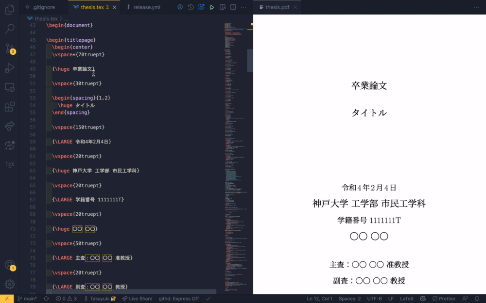

# 神戸大学 工学部 市民工学科 卒論用Latexテンプレート

## Usage

- Dockerの[インストール](https://docs.docker.com/get-docker)
- 以下のようにコンパイル

```console
$ docker --rm run -v /path/to/dir/:/workdir paperist/alpine-texlive-ja platex thesis.tex
$ docker --rm run -v /path/to/dir/:/workdir paperist/alpine-texlive-ja platex thesis.tex
$ docker --rm run -v /path/to/dir/:/workdir paperist/alpine-texlive-ja dvipdfmx thesis.dvi
```

[こちら](https://github.com/TaKO8Ki/civil-engineering-thesis-template/releases/latest/download/thesis.pdf)からダウンロードできるようなPDFが生成されます。

また、[VSCode](https://code.visualstudio.com/)で[latex-workshop](https://marketplace.visualstudio.com/items?itemName=James-Yu.latex-workshop)というextensionを用いると下記のように保存時にコンパイルすることができます。




settings.json
```json
{
    "latex-workshop.latex.recipes": [
        {
            "name": "compile",
            "tools": [
                "platex",
                "platex",
                "dvipdfmx"
            ]
        }
    ],
    "latex-workshop.latex.tools": [
        {
            "name": "ptex2pdf",
            "command": "docker",
            "args": [
                "run",
                "--rm",
                "-v",
                "/Users/tako8ki/GitHub/civil-engineering-thesis-template/:/workdir",
                "paperist/alpine-texlive-ja",
                "ptex2pdf",
                "-l",
                "/workdir/%DOCFILE_EXT%"
            ]
        },
        {
            "name": "platex",
            "command": "docker",
            "args": [
                "run",
                "--rm",
                "-v",
                "/Users/tako8ki/GitHub/civil-engineering-thesis-template/:/workdir",
                "paperist/alpine-texlive-ja",
                "platex",
                "thesis.tex"
            ]
        },
        {
            "name": "dvipdfmx",
            "command": "docker",
            "args": [
                "run",
                "--rm",
                "-v",
                "/Users/tako8ki/GitHub/civil-engineering-thesis-template/:/workdir",
                "paperist/alpine-texlive-ja",
                "dvipdfmx",
                "thesis.dvi"
            ]
        }
    ],
    "latex-workshop.latex.autoBuild.run": "onFileChange",
    "latex-workshop.docker.enabled": true,
    "latex-workshop.view.pdf.viewer": "browser",
    "latex-workshop.latex.clean.fileTypes": [
        "*.aux",
        "*.bbl",
        "*.blg",
        "*.idx",
        "*.ind",
        "*.lof",
        "*.lot",
        "*.out",
        "*.toc",
        "*.acn",
        "*.acr",
        "*.alg",
        "*.glg",
        "*.glo",
        "*.gls",
        "*.ist",
        "*.fls",
        "*.log",
        "*.fdb_latexmk",
        "*.snm",
        "*.nav",
        "*.dvi",
        "*.synctex.gz"
    ],
    "latex-workshop.latex.autoClean.run": "onBuilt",
}
```
